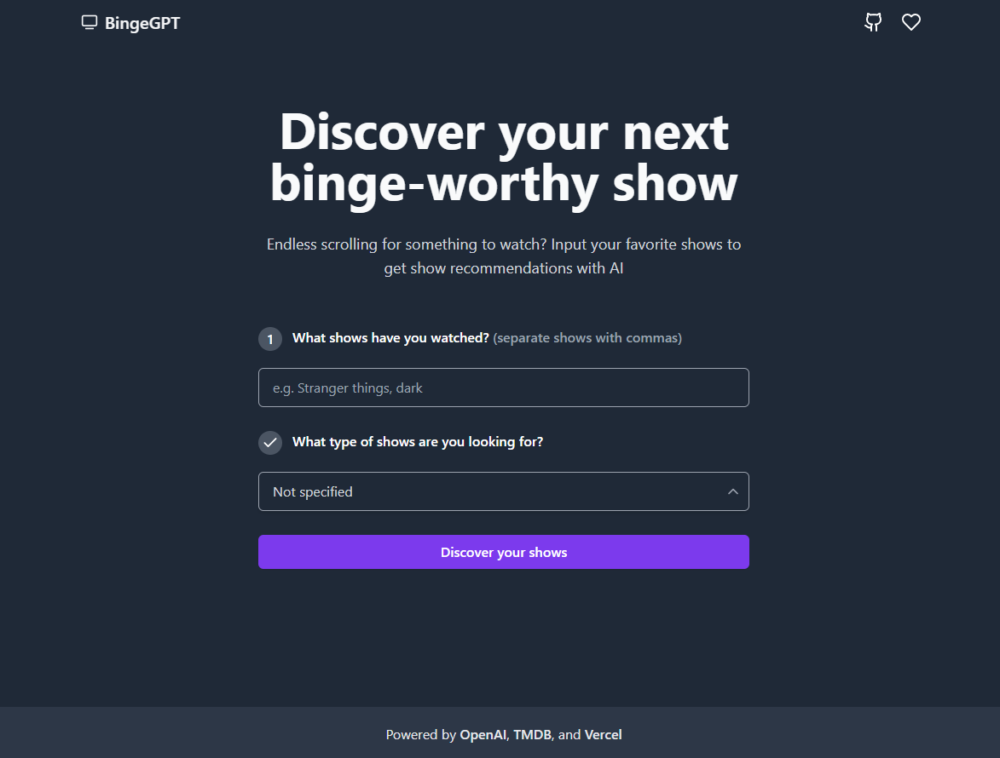

# [BingeGPT](https://bingegpt.vercel.app/)

This project recommends tv shows and movies with OpenAI. The show details are fetched from the TMDB api on click of any recommended show. It is bootstrapped with the [T3 Stack](https://create.t3.gg/).

[](https://bingegpt.vercel.app/)

## Tech Stack

- [Next.js](https://nextjs.org)
- [Prisma](https://prisma.io)
- [Tailwind CSS](https://tailwindcss.com)
- [tRPC](https://trpc.io)
- [OpenAI GPT-3 API](https://platform.openai.com/overview)
- [TMDB API](https://developers.themoviedb.org/3/getting-started/introduction)

## Features

- Recommend tv shows and movies based on user inputed shows
- Fetch show details from TMDB api on click of any recommended show
- Add shows to the favorites list
- Category wise filtering of the favorites list

## Installation

### 1. Clone the repository

```bash
git clone https://github.com/sadmann7/binge-gpt.git
```

### 2. Install dependencies

```bash
yarn install
```

### 3. Create a `.env` file

Create a `.env` file in the root directory and add the environment variables as shown in the `.env.example` file. You can get the OpenAI API key from [here](https://platform.openai.com/account/api-keys). You can get the TMDB API key from [here](https://developers.themoviedb.org/3/getting-started/introduction).

### 4. Run the application

```bash
yarn run dev
```

The application will be available at `http://localhost:3000`.

## Deployment

Follow the deployment guides for [Vercel](https://create.t3.gg/en/deployment/vercel), [Netlify](https://create.t3.gg/en/deployment/netlify) and [Docker](https://create.t3.gg/en/deployment/docker) for more information.
